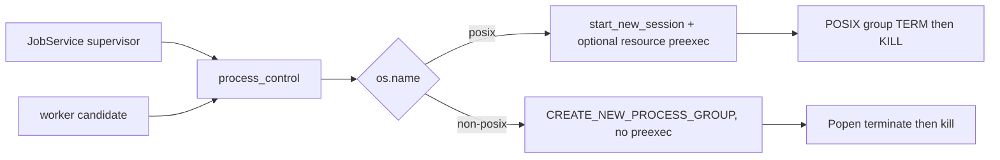

# 迭代 003：设计文档

## 1. 单一进程控制边界

新增 `process_control.py`，让所有受控子进程使用同一组纯辅助函数：

`popen_group_options(preexec_fn=None)` 只返回该平台合法的关键字：

- POSIX：`start_new_session=True`；仅当 caller 传入时加入 `preexec_fn`。
- 非 POSIX：绝不输出以上两个键；若运行时提供
  `subprocess.CREATE_NEW_PROCESS_GROUP`，输出该 `creationflags`。

worker 将 resource limit 的 callable 传入 helper；jobs supervisor 不传。因此 resource
limit 继续只约束不可信 candidate，而不约束 trusted supervisor。

## 2. 最小环境

`platform_environment()` 从 caller 的显式 allowlist 环境副本开始。仅当 `os.name !=
"posix"` 时，若宿主有 `SystemRoot`（兼容大小写读取），把它写入结果。不会复制 HOME、
token、PATH 之外的任意宿主变量，也不会使用 `shell=True`。

worker 与 jobs 都在构造 `Popen` 前调用它，故真实目标环境与 supervisor 环境一致。

## 3. 终止策略

`terminate_popen()` 对已有 Popen 句柄执行：

| 平台 | 优雅阶段 | 升级阶段 |
| --- | --- | --- |
| POSIX | `killpg(pid, SIGTERM)`，等待 2s | `killpg(pid, SIGKILL)` |
| 非 POSIX | `process.terminate()`，等待 2s | `process.kill()` |

`terminate_pid()` 服务于恢复/取消中仅持有 ID 的情况：POSIX 对进程组发送 TERM，非
POSIX 对该 PID 发送 TERM。所有 OSError/已退出情况维持幂等，不改变 job state 流程。
非 POSIX liveness 不使用 `os.kill(pid, 0)`；Windows 的该调用不是无害 probe，可能终止
目标进程。结构有效的已记录 PID 直接进入幂等的 `terminate_pid()`，由操作系统的“已退出”
错误自然收敛。

非 POSIX 的 Popen 终止只能强制结束已知 child；不把它声称为 Windows Job Object 的完整
进程树回收。候选静态验证仍禁止任意 subprocess 入口，降低残留子树风险。

## 4. 测试设计

- 纯 helper 测试 monkeypatch `os.name` 和 `CREATE_NEW_PROCESS_GROUP`，验证 options 和
  SystemRoot 的最小传播；不需要伪造 Windows 文件系统。
- fake Popen 验证非 POSIX `terminate`→`wait`→`kill` 及 POSIX group signal 分支；PID
  liveness 模拟验证非 POSIX 不调用 `waitpid` 或 signal-zero probe。
- 现有真实 `test_cancel_during_active_run` 和 `test_timeout_kills_run` 继续覆盖 macOS/
  Linux 实际 worker；十四格 matrix 验证两类 spawn 均未破坏正常结果。
- CI 仍在可用 runner 上执行；本轮不声称真实 Windows E2E。

## 5. 风险与回滚

| 风险 | 缓解 |
| --- | --- |
| 抽象改变 Popen 参数导致 POSIX resource cap 丢失 | options helper 接收 callable，单测并保留真实 timeout/cancel 回归。 |
| 最小环境遗漏 Windows 启动所需键 | 只补 `SystemRoot`，并为缺失情形保留可预测无新增键行为。 |
| 非 POSIX terminate 无法回收未知孙进程 | 明确不是 Job Object 方案；候选禁止任意进程创建，完整树回收留待有 Windows runner 的迭代。 |
| 共享 helper 被用于不可信 shell | helper 仅接收 Popen kwargs/environment，不提供 shell 或命令拼接 API。 |
