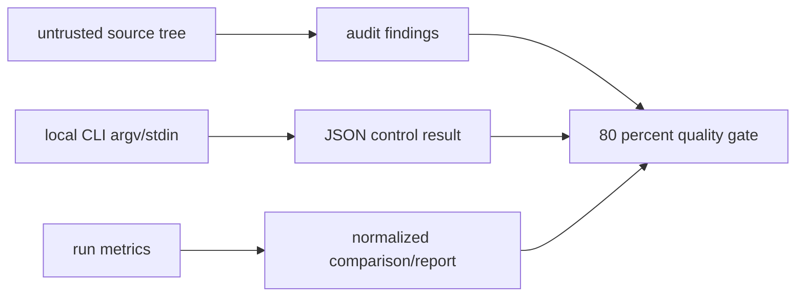

# 迭代 004：设计文档

## 1. 覆盖策略

采用“输入契约 × 安全/控制结果”而不是行数导向测试：

每组测试只使用现有公共函数或 CLI entrypoint。临时文件树只含最小 Python 输入；不会在
仓库 product source 中注入 `eval` 等危险表达式。

## 2. 审计测试设计

创建临时 package 并调用 `audit_independence(root)`：

- 空模块得到 `passed`、完整 assertions 和零 findings；
- `import backtrader_agent` 产生 `sibling_product_import` 与 module；
- `from ..x import y` 产生 `parent_relative_import`；
- `eval("1")` 或 `exec("pass")` 产生 `dynamic_execution` 和 call。

一项测试只断言一个 finding 类型，避免同一文件造成多种结果时掩盖定位。

## 3. CLI 测试设计

测试通过 `main(argv)` 与 `capsys` 观察输出。`Settings.from_env()` 所需 root 指向
`tmp_path`；需要 state 的情形使用 `BacktraderMCPService` 预置合法对象，但行为入口始终是
CLI。

- `list` 对 jobs 的 state filter/summary/limit，`show` 与缺失对象的 ProductError JSON；
- `logs` 对已有/不存在 job 的 stderr；
- `clean` 对 audit/idempotency、审计记录和 JSON response；
- `approve` 的非 TTY `--yes` 需求、用户取消和 token 错误；
- `audit-independence`/`recover` 的正常 JSON。

不以 monkeypatch 取代 CLI 分支，仅为 stdin TTY 回答和不会影响功能的 logger 提供受控替身。

## 4. 报告测试设计

构造完整 canonical metrics baseline，再逐项替换：

- `normalize_metrics`：缺失字段、负/布尔 integer、NaN/inf float、不可 null 字段，及
  nullable null/有限 extra metrics；
- `compare_metrics`：完全相同、整数 mismatch、null mismatch、float tolerance mismatch、
  extra 指标 mismatch；
- `render_markdown`：canonical labels、extra metrics、diagnostic count 和末尾换行。

比较 hash 必须由完整 comparison core 生成，测试不会 hard-code 随机数据。

## 5. Gate 与风险

将 coverage `fail_under` 改为 80，更新 README/CONTRIBUTING/CHANGELOG。若真实覆盖率未到
80，保持 red，继续补有意义的 branch test；禁止加 omit 或把阈值退回 75。

| 风险 | 缓解 |
| --- | --- |
| CLI test 误触宿主 state | 所有 `BACKTRADER_MCP_*` root 指向 tmp_path，且每例隔离。 |
| 测试只验证 mock | audit/reports 直接调用实际实现，CLI 走真正 `main`。 |
| coverage 上升但安全减弱 | 只增加测试和 gate/文档；审计、approval、token、worker 既有完整回归必须通过。 |
