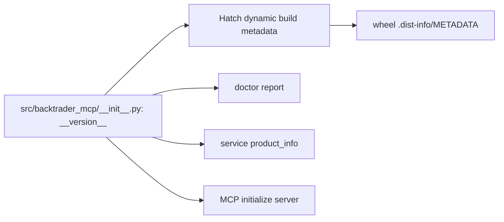

# 迭代 005：设计文档

## 1. 权威源与数据流

__version__ = "0.2.0" 是唯一人工维护的 release version。pyproject.toml 不再有独立
project.version，改为 dynamic = ["version"]，并令 Hatch regex source 读取该文件。service
和 server import 该符号，doctor 已使用该符号。

## 2. 测试设计

### 2.1 Red/green source contract

新增 tests/test_release_version.py：

- 读 pyproject.toml，断言 dynamic 配置及 tool.hatch.version.path；
- 断言 package、doctor report 与 service product info 都使用同一 __version__；
- 检查 server 直接引用 package version，而不是保留 "0.2.0" 的独立 literal。

初始实现预期失败，因为 package/doctor 为 0.1.0，而构建/Server/Service 为 0.2.0。

### 2.2 Installed artifact contract

扩展 tests/test_wheel_distribution.py，断言 wheel METADATA 的 Version: 0.2.0，并在
-S clean import 中输出 installed package __version__。现有 clean-wheel acceptance 已确保
测试只从 wheel target 导入，不借用 source checkout。

### 2.3 文档边界

README 把 release-specific 升级提示改为 0.2.x，并用不绑定版本的表述保留“不迁移
pre-P0 state”的事实。CHANGELOG 记录本次 drift 修复。

## 3. 风险与约束

| 风险 | 缓解 |
| --- | --- |
| dynamic metadata 配置不可构建 | 以真实 clean wheel build/metadata 检查作为门禁，而非只解析 TOML。 |
| source checkout 与 installed distribution 混淆 | wheel test 在 -S + 临时 target 运行，验收记录 origin。 |
| 为修复版本扩大 API | 只替换 release version 的来源，不动 schema、token、state 或依赖范围。 |
| README 误称迁移兼容性 | 使用已有事实的中性表述，不凭空承诺 state migration。 |
