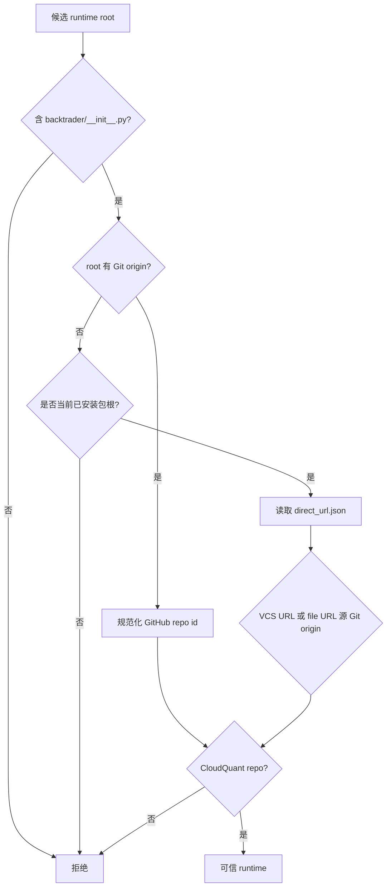

# 迭代 006：CloudQuant Backtrader 运行时来源限制设计

## 固定分发依赖

`pyproject.toml` 的主依赖使用：

```text
backtrader @ git+https://github.com/cloudQuant/backtrader.git@3c967ed61be184c0099ba5bef55d4bed09ad0b4a
```

Hatch 的 `tool.hatch.metadata.allow-direct-references=true` 允许该标准 VCS
direct reference 写入 wheel 元数据。测试 extra 不再重复声明 PyPI Backtrader。

## 来源判定

`backtrader_runtime.py` 将 Git URL 规范化为不含凭证的 repository id。只有
`github.com/cloudquant/backtrader` 是可信来源。



`file://` direct URL 不直接信任本地路径；它必须解析到一个 Git checkout，并由该 checkout 的
`origin` 证明来源。报告只包含规范化后的 repository id，不回显可能带凭证的原始 remote URL。

## 行为边界

- `Settings.from_env()` 仅在 runtime 环境变量完全未设置时，将可信安装包根映射为
  `default`；显式映射始终优先，显式 `{}` 禁止自动发现。
- `JobService.prepare_strategy_run()` 与 `start_strategy_run()` 都调用同一个
  `require_cloudquant_runtime()`，使配置在计划准备后变化时也无法绕过。
- `doctor` 只读地展示 `installed_backtrader`、每个 runtime 的 `repository`、`provenance`
  与 `trusted_source`。安装包不可信是 warning；注册 runtime 不可信是 error。
- `backtrader-mcp install-backtrader` 只在完全缺失时运行 `pip install --upgrade` 固定 Git
  requirement。若已安装但不可信则返回 warning，不作变更。
- 候选策略进程设置 `BACKTRADER_LIGHT_IMPORT=1`，使用 CloudQuant 仓库的核心导入路径；
  `feed_runtime` 直接加载所需的 CSV/Pandas feed 和指标计算 analyzer，避免依赖完整入口的
  可选集成，同时不改变受信任 MCP supervisor 的导入行为。
- `doctor` 的隔离 runtime probe 也使用这一核心导入模式，并直接验证 CSV/Pandas feed 类型，
  因此来源诊断不会因完整入口的可选组件冷启动而把可信运行时误报为不可用。

## 清洁验收

`run_acceptance.py` 在临时 target 中安装 wheel 及其完整依赖，并要求：

1. Backtrader 元数据版本为 `1.3.0`；
2. `inspect_installed_backtrader()` 给出 `trusted=true` 和 CloudQuant repository id；
3. wheel 来源、14 格矩阵、协议测试、独立性审计均通过。

候选进程的核心导入路径会在临时 target 中由 14 格矩阵实际执行，防止 CloudQuant 的完整入口
冷启动再次被 60 秒运行窗口误判为超时。
